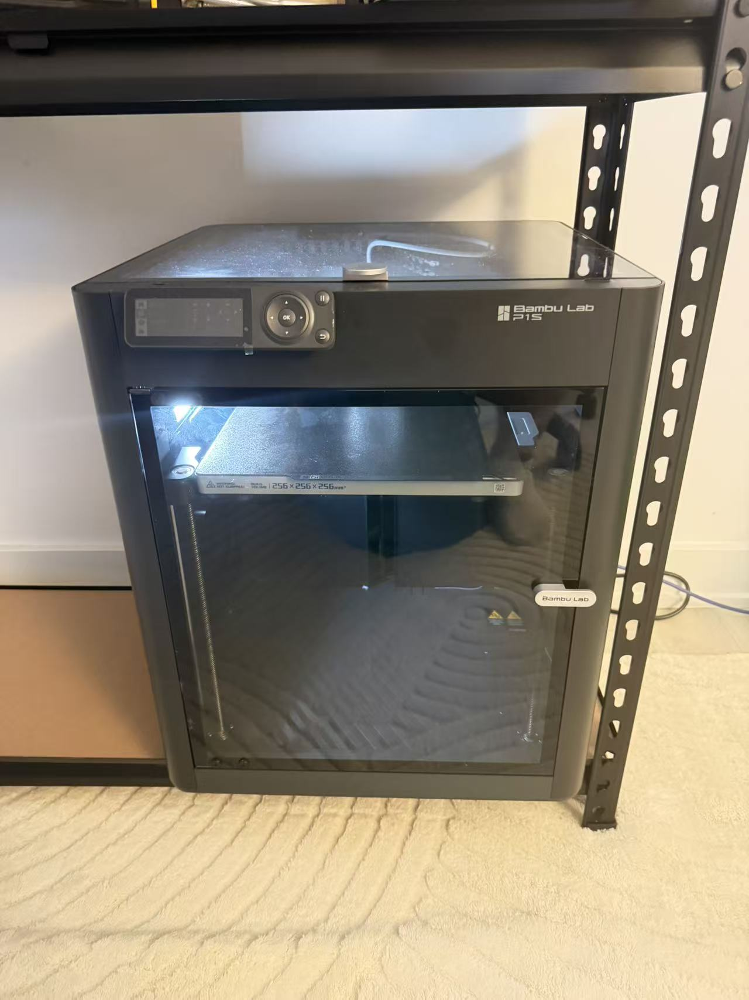

# Tool Reflection: Bambu Lab P1S

One tool I use regularly is my Bambu Lab P1S 3D printer, mainly for making prototypes. It lets me turn digital models into physical objects that I can hold, test, and improve. I first learned about 3D printing in 2017 through online videos. My first printer was an i3-style machine that I built myself, learning step by step how to put together the frame, connect the wiring, and configure the code. Building it helped me understand how the tool worked, as well as how to use it. Now, I use the P1S to bring my project ideas into physical form. Without a 3D printer, I would make prototypes by hand with foam board or clay. I could still explore my ideas, but I would shape and adjust the materials directly instead of changing a digital model and printing a new version.

